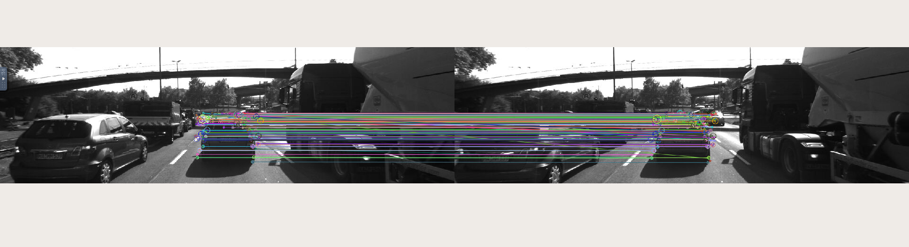

# SFND 2D Feature Tracking

The idea of the camera course is to build a collision detection system - that's the overall goal for the Final Project. As a preparation for this, we have to build the feature tracking part and test various detector / descriptor combinations to see which ones perform best. This mid-term project consists of four parts:

* First, focus on loading images, setting up data structures and putting everything into a ring buffer to optimize memory load. 
* Then, integrate several keypoint detectors such as HARRIS, FAST, BRISK and SIFT and compare them with regard to number of keypoints and speed. 
* In the next part, focus on descriptor extraction and matching using brute force and also the FLANN approach. 
* In the last part, once the code framework is complete, test the various algorithms in different combinations and compare them with regard to some performance measures. 

## Tasks Accomplished

### Task MP.1 Data Buffer Optimization
Implemented ring buffer in which new elements are added to tail end and older items are removed from head end.
It is accomplished using erase() method in vector library.

### Task MP.2 Keypoint Detection
Implemented HARRIS, FAST, BRISK, ORB, AKAZE and SIFT detectors with OpenCV library and made them selectable with a string.

### Task MP.3 Keypoint Removal
Removed keypoints except those on preceding vehicle by removing all keypoints detected outside a predefined reactangle (cv::Rect).

### Task MP.4 Keypoint Descriptors
Implemented BRIEF, ORB, FREAK, AKAZE and SIFT descriptors with OpenCV library and made them selectable with a string.

### Task MP.5 Descriptor Matching
Implemented FLANN matching as well as k-nearest neighbor selection and made them selectable with a string.

### Task MP.6 Descriptor Distance Ratio
Implemented Descriptor Distance Ratio test which looks at the ratio of best to second-best match to decide whether to keep an associated keypoint pair.
Ratio used as 0.8.

### Task MP.7 Performance Evaluation 1
Counted the number of keypoints on the preceding vehicle for all 10 images for all the detectors implemented and analyzed their neighborhood size.
| Detector   | Img 0 | Img 1 | Img 2 | Img 3 | Img 4 | Img 5 | Img 6 | Img 7 | Img 8 | Img 9 | Average |
|------------|-------|-------|-------|-------|-------|-------|-------|-------|-------|-------|---------|
| BRISK      | 264   | 282   | 282   | 277   | 297   | 279   | 289   | 272   | 266   | 254   | 276     |
| AKAZE      | 166   | 157   | 161   | 155   | 163   | 164   | 173   | 175   | 177   | 179   | 167     |
| FAST       | 149   | 152   | 150   | 155   | 149   | 149   | 156   | 150   | 138   | 143   | 149     |
| SIFT       | 138   | 132   | 124   | 137   | 134   | 140   | 137   | 148   | 159   | 137   | 139     |
| Shi Tomasi | 125   | 118   | 123   | 120   | 120   | 113   | 114   | 123   | 111   | 112   | 118     |
| ORB        | 92    | 102   | 106   | 113   | 109   | 125   | 130   | 129   | 127   | 128   | 116     |
| Harris     | 17    | 14    | 18    | 21    | 26    | 43    | 18    | 31    | 26    | 34    | 25      |

BRISK

Highest number of keypoints compared to all other detectors.
Observed large and highly overlapping neighborhood size.

AKAZE

Second highest number of keypoints compared to all detectors.
Some keypoints have large neihborhood size and some have small neighborhood size.
Some of them are overlapped.

FAST

Higher number of keypoints compared to HARRIS, ORB, Shi Tomasi and SIFT. But lower number of keypoints compared to BRISK and AKAZE.
Observed small neighborhood size.

SIFT

Higher number of keypoints compared to Shi Tomasi, ORB and HARRIS. But lower number of keypoints compared to BIRSK, AKAZE and FAST.
Some keypoints have large neighborhood size and some have small neighborhood size.
Few of them are overlapped.

Shi Tomasi

Higher number of keypoints compared to HARRIS and ORB. But lower number of keypoints compared to other detectors.
Observed small neighborhood size.

ORB

Second least number of keypoints compared to all detectors.
Some keypoints have large neighborhood size and some have small neighborhood size.
Few of them are overlapped.

HARRIS

Least number of keypoints compared to other detectors and small neighborhood size.

### Task MP.8 Performance Evaluation 2 & MP.9 Performance Evaluation 3
Implemented additional logic to compute and print data for performance evaluation steps 8 and 9.
Results are as below.
| Detector   | Descriptor | Avg of Total # Keypoints Detected | Detection Time (ms) | Extraction Time (ms) | Avg of # Matched Keypoints | Matching Time (ms) |
|------------|------------|-----------------------------------|---------------------|----------------------|----------------------------|--------------------|
| Shi Tomasi | BRISK      | 1342                              | 21.62               | 3.15                 | 118                        | 0.57               |
| Shi Tomasi | BRIEF      | 1342                              | 21.4                | 2.02                 | 118                        | 0.57               |
| Shi Tomasi | ORB        | 1342                              | 21.21               | 1.19                 | 118                        | 0.56               |
| Shi Tomasi | FREAK      | 1342                              | 16.93               | 55.24                | 118                        | 0.6                |
| Shi Tomasi | AKAZE      | N/A                               | N/A                 | N/A                  | N/A                        | N/A                |
| Shi Tomasi | SIFT       | 1342                              | 16.89               | 23.98                | 118                        | 2.55               |
| Harris     | BRISK      | 173                               | 22.87               | 1.66                 | 23                         | 0.2                |
| Harris     | BRIEF      | 173                               | 24.54               | 1.45                 | 23                         | 0.2                |
| Harris     | ORB        | 173                               | 25.24               | 1.19                 | 23                         | 0.29               |
| Harris     | FREAK      | 173                               | 22.6                | 63.71                | 23                         | 0.21               |
| Harris     | AKAZE      | 173                               | 28.92               | 127.92               | 23                         | 0.17               |
| Harris     | SIFT       | 173                               | 24.73               | 28.54                | 23                         | 0.5                |
| FAST       | BRISK      | 1787                              | 1.4                 | 3.18                 | 149                        | 2.5                |
| FAST       | BRIEF      | 1787                              | 0.97                | 1.24                 | 149                        | 0.75               |
| FAST       | ORB        | 1787                              | 0.95                | 1.9                  | 149                        | 0.67               |
| FAST       | FREAK      | 1787                              | 0.98                | 48.95                | 149                        | 0.75               |
| FAST       | AKAZE      | 1787                              | 0.96                | 100.7                | 149                        | 0.78               |
| FAST       | SIFT       | 1787                              | 0.91                | 36.12                | 149                        | 2.33               |
| BRISK      | BRISK      | 2711                              | 42.8                | 3.44                 | 278                        | 1.98               |
| BRISK      | BRIEF      | 2711                              | 42.57               | 1.38                 | 278                        | 1.98               |
| BRISK      | ORB        | 2711                              | 42.33               | 5.54                 | 278                        | 1.76               |
| BRISK      | FREAK      | 2711                              | 42.29               | 49.73                | 278                        | 1.71               |
| BRISK      | AKAZE      | 2711                              | 42.32               | 92.95                | 278                        | 2.18               |
| BRISK      | SIFT       | 2711                              | 42.57               | 69.26                | 278                        | 4.93               |
| SIFT       | BRISK      | 1386                              | 158.65              | 1.83                 | 138                        | 0.66               |
| SIFT       | BRIEF      | 1386                              | 159.03              | 0.98                 | 138                        | 0.66               |
| SIFT       | ORB        | N/A                               | N/A                 | N/A                  | N/A                        | N/A                |
| SIFT       | FREAK      | 1386                              | 160.95              | 49.19                | 138                        | 0.66               |
| SIFT       | AKAZE      | 1386                              | 163.13              | 89.52                | 138                        | 0.66               |
| SIFT       | SIFT       | 1386                              | 133.33              | 94.65                | 138                        | 2.28               |
| ORB        | BRISK      | 500                               | 9.71                | 1.56                 | 105                        | 0.54               |
| ORB        | BRIEF      | 500                               | 8.89                | 0.85                 | 114                        | 0.56               |
| ORB        | ORB        | 500                               | 8.7                 | 5.58                 | 114                        | 0.44               |
| ORB        | FREAK      | 500                               | 8.65                | 49.04                | 61                         | 0.28               |
| ORB        | AKAZE      | 500                               | 8.82                | 96.06                | 114                        | 0.53               |
| ORB        | SIFT       | 500                               | 12.21               | 81.04                | 114                        | 1.82               |
| AKAZE      | BRISK      | 1342                              | 108.46              | 2.33                 | 165                        | 0.91               |
| AKAZE      | BRIEF      | 1342                              | 106.87              | 1.39                 | 165                        | 0.87               |
| AKAZE      | ORB        | 1342                              | 106.38              | 3.6                  | 165                        | 0.73               |
| AKAZE      | FREAK      | 1342                              | 106.85              | 52.82                | 165                        | 0.86               |
| AKAZE      | AKAZE      | 1342                              | 106.97              | 94.34                | 165                        | 0.91               |
| AKAZE      | SIFT       | 1342                              | 102.53              | 35.71                | 165                        | 2.75               |

Comparing tradeoff between execution time and matched keypoints count, top 3 combinations are as below.
1. BRISK + BRIEF (in terms of accuracy)
2. FAST + BRIEF (in terms of speed)
3. BRISK + BRISK (average speed, best accuracy)

Note: Performance analysis results are tabulated in results/2D_FeatureMatching_Performance.csv

## Dependencies for Running Locally
* cmake >= 2.8
  * All OSes: [click here for installation instructions](https://cmake.org/install/)
* make >= 4.1 (Linux, Mac), 3.81 (Windows)
  * Linux: make is installed by default on most Linux distros
  * Mac: [install Xcode command line tools to get make](https://developer.apple.com/xcode/features/)
  * Windows: [Click here for installation instructions](http://gnuwin32.sourceforge.net/packages/make.htm)
* OpenCV >= 4.1
  * This must be compiled from source using the `-D OPENCV_ENABLE_NONFREE=ON` cmake flag for testing the SIFT and SURF detectors.
  * The OpenCV 4.1.0 source code can be found [here](https://github.com/opencv/opencv/tree/4.1.0)
* gcc/g++ >= 5.4
  * Linux: gcc / g++ is installed by default on most Linux distros
  * Mac: same deal as make - [install Xcode command line tools](https://developer.apple.com/xcode/features/)
  * Windows: recommend using [MinGW](http://www.mingw.org/)

## Basic Build Instructions

1. Clone this repo.
2. Make a build directory in the top level directory: `mkdir build && cd build`
3. Compile: `cmake .. && make`
4. Run it: `./2D_feature_tracking`.
